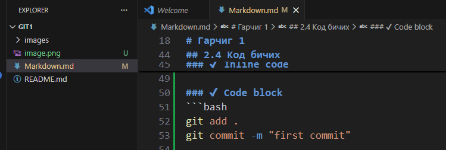
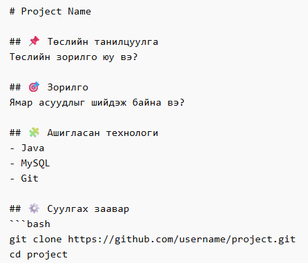

# 1. Markdown гэж юу вэ?

**Markdown** бол энгийн текстийг форматтай харагдуулах бичгийн хэл.

- .md өргөтгөлтэй
- GitHub, GitLab, Bitbucket бүгд дэмждэг
- HTML бичихгүйгээр гоё харагддаг

# 2. Markdown үндсэн синтакс
2.1 Гарчиг (Heading)
# H1
## H2
### H3
#### H4

Жишээ:

# Гарчиг 1
## Гарчиг 2
### Гарчиг 3

## 2.2 Тод (Bold) ба Налуу (Italic)
**Bold текст**
*Italic текст*

**Bold текст**
*Italic текст*

## 2.3 Жагсаалт (List)
### ✔ Дараалалгүй жагсаалт
- Item 1
- Item 2
  - Sub item

- Item 1
- Item 2
  - Sub item

### ✔ Дараалалтай жагсаалт
1. First
2. Second
3. Third

## 2.4 Код бичих
### ✔ Inline code
`git status`

### ✔ Code block
```bash
git add .
git commit -m "first commit"

Жишээ:

```bash
git add .
git commit -m "first commit"

``` 

## 2.5 Link хийх
[Google](https://google.com)


## 2.6 Зураг оруулах





## 2.7 Хүснэгт (Table)
| Нэр | Нас | Мэргэжил |
|-----|-----|----------|
| Бат | 20  | IT       |
| Болд| 22  | SE       |


# 3. Стандарт README.md бүтэц

Хичээлд ашиглах **стандарт бүтэц**:


# 5. Сайн README ямар байх ёстой вэ?

- ✔ Товч
- ✔ Ойлгомжтой
- ✔ Суулгах заавартай
- ✔ Ашигласан технологи тодорхой
- ✔ Screenshot байвал бүр сайн